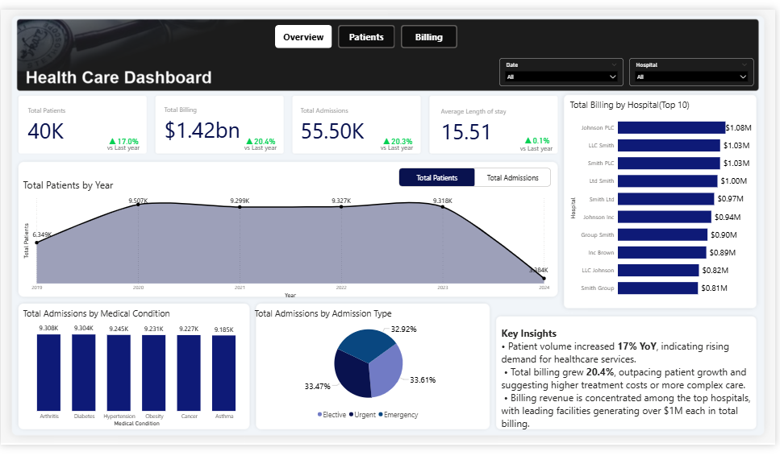
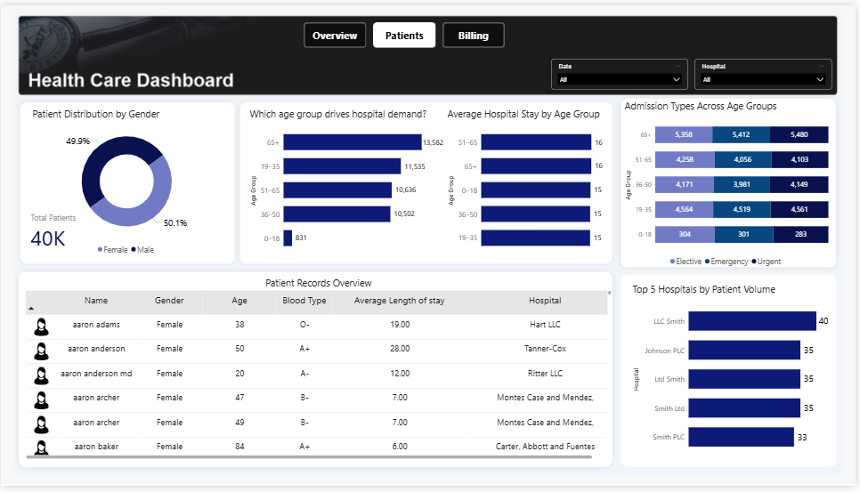
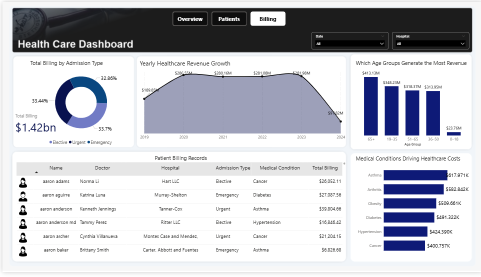

# Healthcare Analytics Dashboard
##  Table of Content
- [Project Overview](#Project-Overview)
- [Data Source](#Data-Source)
- [Tools Used](#Tools-Used)
- [Data Preparation and Cleaning](#Data-Preparation-and-Cleaning)
- [Exploratory Data Analysis](#Exploratory-Data-Analysis)
- [Data Analysis](#Data-Analysis)
- [Key Insights](#key-Insights)
- [Dashboard Preview](#Dashboard-Preview)
- [Recommendations](#Recommendations)

## Project Overview

This project analyzes healthcare data to identify patterns in patient demographics, hospital admissions, and billing trends. The goal is to provide actionable insights that help healthcare administrators understand demand and revenue distribution.

## Data Source
The dataset for this project was gotten from Kaggle.com

## Tools Used

* SQL
  - Database & Table Setup
  - Normalizing Data
  - Creating Views
  - Data Cleaning
  - Fixing Date Issues
* Power BI
  - Dax Measures
  - Data Visualization
 
## Data Preparation and Cleaning
- Data was cleaned using Sql
- Data was stored in a Database in MySql
- View was created to provide necessary data for analysis
## Exploratory Data Analysis
 EDA was performed to answer the following questions
  * How has patient volume changed over time?
  * Which hospitals generate the most billing revenue?
  * Which medical conditions drive hospital admissions?
  * Which age groups generate the highest healthcare costs?
## Data Analysis
### SQL
  - Creating Views

   ```sql
  Create OR REPLACE View healthcare_new AS select ID, Name, Age, Gender, `Blood Type`, `Medical Condition`, `Date of Admission`, `Discharge Date`, Doctor, Hospital, `Insurance Provider`, `Billing Amount`, `Admission Type` from healthcare;
  ```

   - Calculating Length of Stay
  ``` sql
  select Name, `Discharge Date`,`Date of Admission`, datediff(`Discharge Date`,`Date of Admission`) as 'Length_of_Stay'
  from healthcare_new;
  ```
  - Revenue Analysis
  ``` sql
  select `Medical Condition`, Avg(`Billing Amount`) as Average_Billing
  from healthcare_new
  group by `Medical Condition`
  order by Average_Billing DESC;
  ```
  - Window Function
  ```sql
    select * from (
    select hospital, Name, `Billing Amount`,
    Rank() over(partition by hospital order by `Billing Amount` DESC) AS RNK
    from healthcare_new ) t where rnk = 1;
   ```
  - Age Grouping
  ```sql
  Select Case
    When Age < 18 then 'Child'
    When Age Between 18 And 40 Then 'Young Adult'
    When Age Between 41 and 65 Then 'Adult'
    Else 'Senior'
  End as 'Age_Group', count(*) as patient
  from healthcare_new
  Group by Age_Group;
  ```

  ### Power BI
  - Total Patient
  ``` DAX
  Total Patients = DISTINCTCOUNT('healthcare_db healthcare_new'[Name])
```
 - Yoy Patient
  ```PY% patients = 
var currentpatients=[Total Patients]
var prevpatient=[Py Patients]
var percentpatient= DIVIDE(currentpatients-prevpatient,prevpatient)
RETURN
if(percentpatient>0,"▲"&FORMAT(percentpatient,"0.0%"),"▼"&FORMAT(percentpatient,"0.0%"))
```
- Parameter
  ``` Dax 
  Parameter = {
    ("Total Patients", NAMEOF('Dax'[Total Patients]), 0),
    ("Total Admissions", NAMEOF('Dax'[Total Admissions]), 1)}
  ```

## Key Insights

* Patient volume increased by **17% year-over-year**.
* Healthcare billing grew by **20.4%**, slightly outpacing patient growth.
* Patients aged **65+ generate the highest revenue**.
* **Asthma treatments produce the highest billing totals** among medical conditions.

## Dashboard Preview

### Overview Page



### Patients Page



### Billing Page



## Recommendations
  - Increase medical resources for high-demand conditions such as asthma and obesity.
  - Develop preventive healthcare programs targeting high-risk age groups.
  - Strengthen partnerships with efficient insurance providers to improve billing processes.
  - Reduce patient length of stay through improved care coordination.
  - Analyze top-performing hospitals and replicate best practices.


